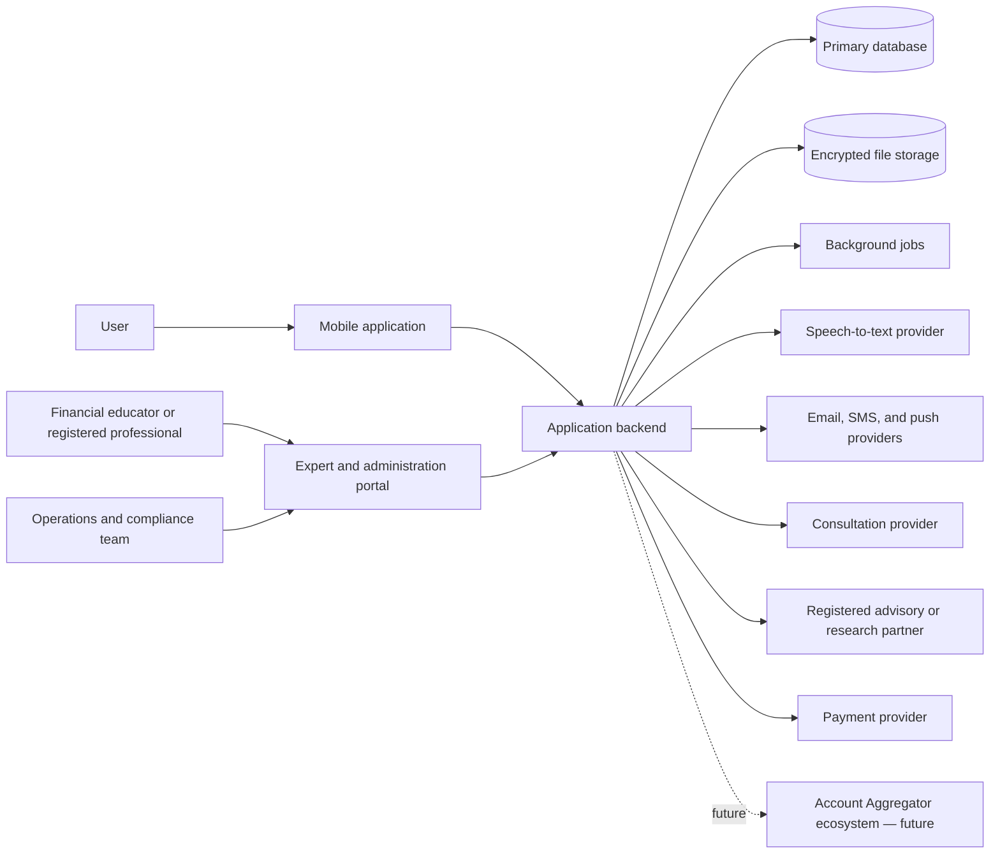

# Financial Companion App Architecture

## 1. Document status

This document defines the target structure for the first production version of the Financial Companion app. The repository now contains a working validation slice; target components that are not yet production-backed remain explicitly identified in the README and the implementation audit.

The latest implementation and flow audit is documented in
`docs/architecture/flow-audit-2026-08-01.md`.

The product begins as a financial education, budgeting, and planning application for Indian users. It does not initially hold money or execute investments.

## 2. Architecture goals

- Deliver an Android-first product without preventing future iOS and web clients.
- Keep the first version small enough for an early-stage team to operate.
- Separate general education from regulated investment advice and securities research.
- Protect sensitive financial, identity, and voice data.
- Support English first, followed by Hindi, Hinglish, and additional Indian languages.
- Allow manual and voice-based expense entry.
- Produce explainable financial health assessments and money roadmaps.
- Make external integrations replaceable rather than embedding vendors throughout the codebase.
- Support a free beta now and subscriptions, employer plans, and paid advisory services later.

## 3. Architectural approach

The MVP should use a **modular monolith**, not independent microservices.

A modular monolith provides one deployable backend while maintaining strict boundaries between business domains. It is faster to build and operate than microservices, while still allowing high-load or regulated modules to be extracted later.

The main boundaries are:

- Identity and consent
- User financial profile
- Budgeting and transactions
- Financial assessment and roadmap
- Education
- Investment information
- Expert consultations
- Notifications
- Billing and entitlements
- Compliance and audit

## 4. System context



## 5. Proposed repository structure

```text
financial-companion/
├── apps/
│   ├── mobile/                    # Android-first cross-platform user app
│   ├── portal/                    # Expert, operations, content, and compliance portal
│   └── api/                       # Backend entry point and HTTP API
│
├── packages/
│   ├── domain/                    # Business entities, rules, and domain events
│   ├── contracts/                 # Shared API schemas and generated client types
│   ├── design-system/             # Shared visual components and accessibility rules
│   ├── localization/              # Translation keys, terminology, and locale helpers
│   ├── financial-engine/          # Health score, risk, goals, and roadmap rules
│   ├── security/                  # Authorization, encryption, redaction, and consent helpers
│   ├── observability/             # Logging, metrics, tracing, and error reporting
│   └── test-support/              # Fixtures, factories, mocks, and test utilities
│
├── services/
│   └── workers/                   # Speech processing, reports, reminders, and scheduled jobs
│
├── content/
│   ├── lessons/                   # Versioned educational content
│   ├── questionnaires/            # Financial health and risk questions
│   ├── disclosures/               # Regulatory notices and product disclosures
│   └── translations/              # Reviewed localized financial content
│
├── infrastructure/
│   ├── environments/              # Development, staging, and production configuration
│   ├── database/                  # Migrations, seeds, and database policies
│   ├── deployment/                # Deployment definitions
│   └── monitoring/                # Dashboards, alerts, and service-level objectives
│
├── docs/
│   ├── product/                   # Product scope and user journeys
│   ├── compliance/                # Regulatory boundaries and operating procedures
│   ├── security/                  # Threat models and incident procedures
│   ├── adr/                       # Architecture decision records
│   └── runbooks/                  # Operational and support instructions
│
├── tests/
│   ├── end-to-end/                # Complete user journeys
│   ├── integration/               # Database and external-provider tests
│   ├── security/                  # Authorization and privacy regression tests
│   └── performance/               # Load and response-time tests
│
├── scripts/                       # Local setup and safe maintenance utilities
├── architecture.md
└── README.md
```

## 6. Application responsibilities

### `apps/mobile`

The user-facing application owns:

- Onboarding and language selection
- Financial profile forms
- Risk and financial-health questionnaires
- Money Roadmap presentation
- Manual and voice expense entry
- Budget dashboards and insights
- Contextual learning
- Investment-category comparisons
- Consultation booking
- Consent and privacy controls
- Subscription screens when monetization begins

The mobile app must not contain authoritative financial rules. It displays results calculated and versioned by the backend so that rule changes are consistent and auditable.

### `apps/portal`

The internal portal should use role-based views for:

- Financial educators
- Registered advisers
- Research analysts
- Content reviewers
- Customer support
- Compliance reviewers
- System administrators

An educator must not automatically receive adviser permissions. Access to personal financial information should be limited to the minimum required for each role.

### `apps/api`

The API coordinates authentication, domain modules, persistence, external providers, and background jobs. It should expose versioned interfaces to the mobile app and portal.

The backend should start as one deployable application with internal modules rather than a collection of networked services.

## 7. Backend domain modules

### Identity and access

- User registration and sign-in
- Session and device management
- Role-based authorization
- Expert credential status
- Account recovery
- Account export and deletion

### Consent and privacy

- Versioned consent records
- Separate consent for audio retention
- Purpose and retention metadata
- Consent withdrawal
- Data-access history
- Deletion and anonymization workflows

### Financial profile

- Income and employment
- Household and dependants
- Assets and liabilities
- Insurance awareness
- Goals and time horizons
- Profile-history snapshots

Financial profiles should be append-only or versioned where practical. Advice must remain connected to the profile information used when it was created.

### Transactions and budgeting

- Manual transactions
- Voice-derived transactions
- Categories and custom categories
- Recurring transactions
- Budget limits
- Monthly summaries
- Spending-pattern detection
- User corrections

User corrections should feed future categorization improvements without silently rewriting historical entries.

### Financial engine

The engine produces:

- Financial health score and explanation
- Emergency-fund status
- Debt-priority alerts
- Cash-flow assessment
- Risk willingness
- Risk capacity
- Combined risk profile
- Goal projections
- Prioritized Money Roadmap
- Monthly recommended actions

Every output must include:

- Rule-set version
- Input snapshot
- Explanation or rationale
- Creation date
- Relevant warnings

The engine should be deterministic and rules-based initially. Machine learning may assist categorization or language understanding, but it should not independently generate regulated financial recommendations.

### Education

- Learning paths
- Lessons and quizzes
- Prerequisites
- User progress
- Contextual lesson recommendations
- Content versions
- Reviewer approval
- Language variants

Published financial content should have an author, qualified reviewer, approval date, and review-expiry date.

### Investment information

This module provides general information about investment categories and, later, approved product or security research.

The beta Investment Explorer is limited to the first category. It stores
immutable preference and result snapshots tied to the current profile,
assessment, goal, consent disclosure, category-content version, and rule-set
version. It may change warnings and learning order but must not produce product
eligibility, allocation, or transaction output.

It must distinguish among:

1. General financial education
2. Personalized investment advice
3. Security-specific research

The source, reviewer, disclosure, and regulatory status of each item must be visible and stored.

### Consultations

- Expert directory
- Credentials and permitted service types
- Availability
- Booking
- Consent
- Session notes
- Follow-up actions
- Escalation from educator to registered professional

Recorded calls require explicit, separate consent. The system should support consultations without recording.

### Notifications

- Budget reminders
- Roadmap actions
- Learning reminders
- Goal progress
- Appointment notifications
- Security and privacy alerts

Users need per-channel and per-purpose controls. Marketing consent must be separate from essential service communication.

### Billing and entitlements

This module can remain disabled during the free beta but should be designed for:

- Free and premium plans
- Trial periods
- Course purchases
- Consultation payments
- Employer-sponsored access
- Refunds
- Invoices
- Feature entitlements

Payment-card details should remain with the payment provider rather than the application database.

### Compliance and audit

- Immutable audit events
- Adviser and analyst credentials
- Advice rationale
- Disclosure acceptance
- Conflict-of-interest records
- Complaint management
- Content approval
- Data-access reviews

Audit data should record who performed an action, what changed, when it changed, and the relevant user or case.

## 8. Core data ownership

| Data | Owning module | Notes |
|---|---|---|
| Account and login | Identity | Keep separate from financial profile where possible |
| Consent | Consent and privacy | Versioned and purpose-specific |
| Income, debt, assets, goals | Financial profile | Sensitive and access-controlled |
| Expenses and budgets | Transactions and budgeting | User-correctable |
| Health and risk results | Financial engine | Store inputs, outputs, and rule version |
| Lessons and progress | Education | Separate draft and published content |
| Explorer preferences and results | Investment information | Immutable, versioned educational context |
| Advice and rationale | Investment information | Immutable after publication; corrections create a new version |
| Appointment and notes | Consultations | Access based on professional role |
| Payments | Billing | Store provider references, not card data |
| Administrative actions | Compliance and audit | Append-only |

## 9. Important data flows

### Voice expense entry

1. The mobile app asks for microphone permission.
2. Audio is uploaded through an encrypted, short-lived upload.
3. A worker sends the audio to the configured speech provider.
4. The transcript is parsed into proposed transactions.
5. The user confirms or edits each transaction.
6. Confirmed transactions are stored.
7. Audio is deleted by default.
8. Audio is retained only when the user has explicitly opted in.

The raw transcript must never be treated as a confirmed financial record.

### Money Roadmap generation

1. The user submits or updates their financial profile.
2. The financial engine validates required information.
3. The engine calculates health, readiness, and risk results.
4. It generates prioritized actions and explanations.
5. The complete input and rule versions are stored.
6. The mobile app presents the roadmap and relevant lessons.

### Investment Explorer

1. The user accepts the dedicated investment-exploration disclosure.
2. The user selects a current goal or general learning and one or more category
   interests.
3. The API verifies that the assessment belongs to the current profile.
4. The deterministic engine applies financial-foundation, risk, horizon, and
   liquidity context to every selected category without hiding any category.
5. The immutable preference and result snapshots are stored with content and
   rule versions.
6. The mobile app presents category education or creates a contextual
   educational-call request.
7. A profile or assessment change makes the current result stale; historical
   output remains exportable and deletable.

### Personalized advice

1. The user completes required financial and risk information.
2. The system verifies the professional or partner’s permitted role.
3. The adviser reviews the current profile and suitability information.
4. Advice and rationale are recorded.
5. Required disclosures are presented to the user.
6. User acknowledgement is recorded.
7. Later changes create a new advice version rather than overwriting the original.

## 10. API conventions

- Use versioned APIs, beginning with `/v1`.
- Validate all requests against shared schemas.
- Use stable identifiers rather than exposing sequential database IDs.
- Make write operations idempotent where retries are likely.
- Paginate collection endpoints.
- Return structured error codes suitable for localization.
- Never include secrets, full voice transcripts, or unnecessary financial values in logs.
- Require stronger authorization checks for support, expert, and administration endpoints.

## 11. Localization

All user-facing text should use translation keys rather than being embedded in application logic.

Financial translations require human review because an inaccurate translation may change the meaning of risk, returns, debt, or consent. The initial order should be:

1. English
2. Hindi
3. Hinglish voice and conversational support
4. Additional languages based on user demand

Content and legal disclosures must have independent version numbers for each language.

## 12. Security and privacy baseline

- Encrypt network traffic and stored sensitive data.
- Apply least-privilege access to users, staff, and infrastructure.
- Require multi-factor authentication for experts and administrators.
- Keep production data out of development and test environments.
- Redact financial values, tokens, transcripts, and personal information from logs.
- Record internal access to sensitive user profiles.
- Rotate credentials and external-provider keys.
- Scan dependencies and deployment images.
- Back up encrypted data and test restoration.
- Provide user-visible export, correction, consent-withdrawal, and deletion workflows.
- Define retention periods for audio, transcripts, consultations, audit events, and support records.

The privacy design should be reviewed against India’s Digital Personal Data Protection requirements before launch.

## 13. Reliability and operations

### Environments

- **Local:** synthetic data and local dependencies
- **Development:** shared engineering environment with test accounts
- **Staging:** production-like environment with no production personal data
- **Production:** restricted access and audited changes

### Observability

Monitor:

- API availability and latency
- Authentication failures
- Background-job failures
- Speech-processing time and error rate
- Roadmap-generation failures
- Notification delivery
- External-provider health
- Suspicious administrative access

Technical logs should not be used as financial audit records. Compliance events require their own durable audit store.

## 14. Testing strategy

### Unit tests

- Financial calculations
- Risk classification
- Roadmap ordering
- Budget calculations
- Permission rules
- Localization fallbacks

### Integration tests

- Database transactions
- File retention and deletion
- Speech provider adapter
- Notification provider
- Payment provider
- Adviser or research partner integration

### End-to-end tests

- New user receives a roadmap
- Voice entry becomes a confirmed transaction
- User corrects a transaction category
- User withdraws audio consent
- User exports and deletes their account
- Educator cannot perform adviser-only actions
- Adviser records advice and disclosures

### Additional verification

- Accessibility testing
- Security testing
- Financial-rule review by qualified professionals
- Translation review by fluent financial-content reviewers
- Load testing before employer or nationwide launches

## 15. Deployment evolution

### MVP

- Modular monolith API
- One primary relational database
- Encrypted object storage
- Background job queue
- Mobile app
- Internal portal

### Growth stage

Extract a module only when scale, security isolation, team ownership, or regulation justifies it. Likely candidates are:

- Speech-processing workers
- Notification delivery
- Reporting and analytics
- Regulated advice records
- External financial-data integrations

Microservices should be a response to measured constraints, not a starting requirement.

## 16. Initial implementation order

1. Repository tooling, environments, and shared contracts
2. Identity, authorization, and consent
3. Financial profile
4. Financial engine and explainable roadmap
5. Manual transactions and budgeting
6. Voice transaction workflow
7. Contextual education
8. Expert portal and consultation booking
9. Compliance audit and operational reporting
10. Billing, employer plans, and regulated partner integrations

## 17. Explicit MVP exclusions

- Holding or transferring user funds
- Placing investment orders
- Collecting broker or bank passwords
- Automated individual stock picks
- Guaranteed-return calculations
- Fully automated personalized investment advice
- Automatic bank-account aggregation
- Support for every Indian language at launch
- Complex tax filing

These capabilities may be evaluated later through regulated partners and separately reviewed architecture decisions.

## 18. Architecture decision records

Significant decisions should be documented in `docs/adr/`, including:

- Mobile technology choice
- Backend language and framework
- Database selection
- Authentication provider
- Speech-to-text provider
- Data-retention periods
- Health-score and risk-model governance
- Advisory partner integration
- Account Aggregator integration
- Conditions for extracting a microservice

Each record should include the context, decision, alternatives, consequences, owner, and review date.
