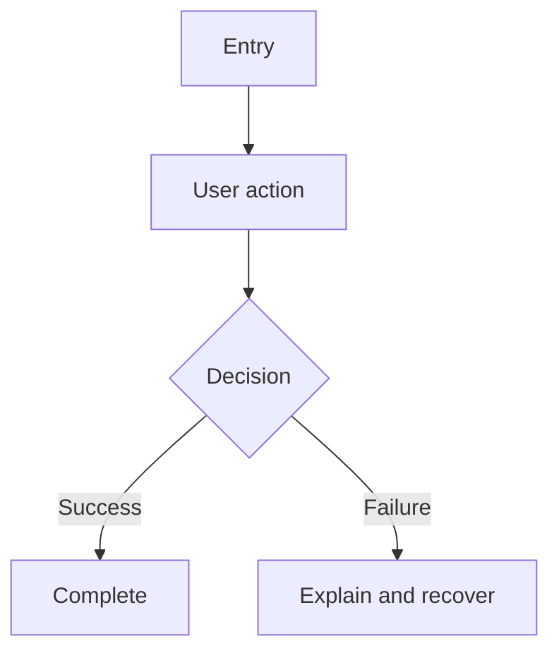

# Financial Companion — Workflow Guidelines

## 1. Purpose

This document defines how product, design, financial experts, compliance, and engineering collaborate on the Financial Companion app.

The process is designed to keep features:

- Useful to financially inexperienced users
- Small enough to build and test incrementally
- Explainable and auditable
- Safe for sensitive financial and voice data
- Clearly separated into education, advice, and research
- Consistent across mobile, internal portal, backend, and content
- Ready for English, Hindi, Hinglish, and future Indian languages

These guidelines work alongside [`architecture.md`](./architecture.md). Architecture decisions belong in `docs/adr/`; feature requirements belong in `docs/stories/`.

## 2. Core principles

### User outcome before feature count

Every story must improve a measurable user outcome. Shipping more screens is not an outcome.

Examples of valid outcomes:

- A user understands their next financial action.
- A user records an expense in less than 15 seconds.
- A user identifies that expensive debt should be addressed before taking substantial investment risk.
- A user understands why a financial product may or may not suit them.

### Story before implementation

User-facing features, financial calculations, data-processing changes, and regulated workflows require an approved story before implementation.

Small refactors, documentation corrections, dependency maintenance, and urgent defect fixes may use a shorter issue format when they do not change user behaviour, financial logic, data use, or compliance obligations.

### Explainability before automation

Financial health scores, risk results, roadmap actions, spending insights, and recommendations must include an understandable rationale.

Automated output must never become unreviewable simply because it was generated by a model or external provider.

### Suitability before returns

The app must not promote higher-risk options merely because a user requests a particular return.

When personalized guidance is involved, the workflow must consider the user's goals, financial situation, investment duration, risk willingness, risk capacity, and ability to absorb loss.

### Consent before sensitive processing

Before collecting or using voice, financial, identity, consultation, or connected-account data, the story must define:

- The purpose
- The minimum information needed
- The consent experience
- Retention
- Access
- Correction
- Export
- Deletion
- Consent withdrawal

### Human accountability

Automated systems may assist with transcription, categorization, calculations, education, and drafting. A named product owner and, where necessary, a qualified financial or compliance reviewer remain accountable.

### Build the MVP, preserve the platform vision

Stories must respect the current phase. The first release focuses on financial assessment, Money Roadmap, budgeting, voice entry, contextual education, and introductory consultations.

Future transaction execution, automatic account aggregation, specific securities recommendations, and broad language expansion require separate approval and architecture decisions.

## 3. Sources of truth

| Information | Source |
|---|---|
| System boundaries and repository structure | `architecture.md` |
| Feature requirements and acceptance criteria | `docs/stories/` |
| Important technical decisions | `docs/adr/` |
| Financial and compliance operating rules | `docs/compliance/` |
| Threat models and security procedures | `docs/security/` |
| Published educational content | `content/lessons/` |
| Questionnaires and scoring inputs | `content/questionnaires/` |
| User disclosures | `content/disclosures/` |
| Operational procedures | `docs/runbooks/` |

If sources conflict, stop implementation and resolve the conflict with the relevant owners. Do not silently choose one.

## 4. Story domains and identifiers

Story IDs use `<DOMAIN>-<FOUR-DIGIT-NUMBER>`.

| Prefix | Domain | Examples |
|---|---|---|
| `AUTH` | Identity and authentication | Registration, login, account recovery |
| `CONS` | Consent and privacy | Audio consent, export, deletion |
| `PROF` | Financial profile | Income, debt, dependants, goals |
| `TXN` | Transactions | Manual and voice expense entry |
| `BDGT` | Budgeting | Category limits, monthly insights |
| `HLTH` | Financial health | Score and explanation |
| `RISK` | Risk assessment | Willingness, capacity, result |
| `ROAD` | Money Roadmap | Prioritized actions and progress |
| `EDU` | Financial education | Lessons, quizzes, learning paths |
| `INVS` | Investment information | Category comparisons and disclosures |
| `RSCH` | Securities research | Security-specific research, future |
| `CONSULT` | Expert consultations | Booking, notes, escalation |
| `NOTIFY` | Notifications | Reminders and user controls |
| `BILL` | Billing and entitlements | Plans, payments, employer access |
| `COMP` | Compliance and audit | Credentials, rationale, complaints |
| `L10N` | Localization | Languages and terminology |
| `ADMIN` | Internal portal | Operations and content management |
| `UI` | Shared experience | Design system and accessibility |
| `PLAT` | Platform | Observability, deployment, shared infrastructure |

Examples:

- `TXN-0001`: Record a manual expense
- `TXN-0002`: Create transactions from a voice entry
- `ROAD-0001`: Generate the initial Money Roadmap
- `CONS-0003`: Withdraw consent for saved audio

Number stories sequentially within each domain. Do not reuse retired story IDs.

## 5. Story documentation structure

```text
docs/stories/
├── README.md
├── auth/
│   ├── README.md
│   ├── story-AUTH-0001-create-account.md
│   └── user-flows/
│       └── registration.md
├── transactions/
│   ├── README.md
│   ├── story-TXN-0001-manual-expense.md
│   ├── story-TXN-0002-voice-expense.md
│   └── user-flows/
│       └── voice-expense-entry.md
└── roadmap/
    ├── README.md
    ├── story-ROAD-0001-initial-roadmap.md
    └── user-flows/
        └── onboarding-to-roadmap.md
```

Each domain `README.md` contains:

- Domain purpose
- Domain owner
- Important boundaries
- Story index
- User-flow index
- Relevant architecture and compliance links
- Current implementation status

## 6. Financial-safety classification

Every story must declare one classification.

### `GENERAL`

General product behaviour with no financial interpretation.

Examples:

- Navigation
- Theme
- Appointment calendar layout

### `FINANCIAL-EDUCATION`

General educational information that is not personalized to a security or product.

Examples:

- Explaining emergency funds
- Comparing general characteristics of asset categories

Requires financial content review.

### `FINANCIAL-GUIDANCE`

Personalized output concerning budgeting, financial readiness, goals, or investment categories.

Examples:

- Debt-priority alert
- Personalized emergency-fund target
- Risk profile
- Money Roadmap

Requires financial-methodology and compliance review.

### `REGULATED-ADVICE`

Personalized advice involving particular securities or investment products.

Requires:

- Approved regulatory operating model
- Appropriately qualified or registered professional
- Suitability process
- Advice rationale
- Required disclosures
- Immutable audit record

This classification is outside the initial MVP unless separately approved.

### `SECURITIES-RESEARCH`

Security-specific analysis, ranking, opinion, or recommendation.

Requires an approved Research Analyst operating model and associated review, disclosure, and recordkeeping.

This classification is outside the initial MVP unless separately approved.

When uncertain, choose the higher-risk classification and request compliance review.

## 7. Story-driven development process

### Phase 1: Discovery

#### Step 1: Define the problem

Document:

- Who experiences the problem?
- What are they trying to accomplish?
- What happens today?
- Why is the current experience insufficient?
- What evidence supports the problem?
- What outcome would indicate improvement?

#### Step 2: Define scope

List:

- Included behaviour
- Explicit exclusions
- Dependencies
- Assumptions
- Rollout audience
- Whether the feature is MVP, growth, or future platform work

#### Step 3: Classify risk

Complete:

- Financial-safety classification
- Personal-data classification
- Regulatory review requirement
- Security review requirement
- Qualified financial review requirement

#### Step 4: Map the user flow

Document:

- Entry points
- Main success path
- Decisions
- Loading and processing states
- Empty states
- Validation failures
- Provider failures
- Permission or consent denial
- Cancellation
- Recovery and retry
- Final user state

For sensitive or multi-step flows, include a Mermaid diagram.

### Phase 2: Story definition

#### Step 1: Create the story file

Use the template in this document.

#### Step 2: Create or update flow documentation

Place detailed flows in the domain's `user-flows/` directory.

#### Step 3: Define acceptance criteria

Criteria must be observable and testable. Avoid phrases such as:

- Works correctly
- Is user-friendly
- Handles errors
- Is secure

Replace them with specific behaviour and expected results.

#### Step 4: Complete required reviews

Possible reviewers:

- Product
- Design
- Engineering
- Financial expert
- Compliance
- Security and privacy
- Localization
- Operations or customer support

### Phase 3: Design

Design must cover:

- Primary journey
- Loading, empty, error, and success states
- Permission and consent states
- Correction and undo
- Accessibility
- Small and large mobile layouts
- Internal portal layout where applicable
- English copy
- Hindi or Hinglish considerations when relevant
- Financial explanations and warnings

The design must not use colour alone to communicate financial risk, success, or failure.

### Phase 4: Implementation

Implement one independently testable story at a time.

Follow these rules:

- Respect the module boundaries in `architecture.md`.
- Keep authoritative financial rules in `packages/financial-engine/` or the relevant backend module.
- Do not duplicate financial logic in the mobile app.
- Use shared API contracts.
- Use versioned APIs.
- Keep external providers behind adapters.
- Never log sensitive financial values, raw audio, complete transcripts, tokens, or identity documents.
- Do not store financial profiles or transaction histories in browser `localStorage`.
- Use platform-secure storage only for the minimum device credentials approved by the security design.
- Create immutable versions rather than overwriting published advice, research, disclosures, or financial-rule results.
- Add audit events for sensitive staff actions.

### Phase 5: Verification

Run the tests and reviews required by the story classification.

At minimum, verify:

- Main success path
- Validation errors
- Permission denial
- Consent denial or withdrawal
- Loading state
- Empty state
- Provider or network failure
- Retry behaviour
- Duplicate submission
- Accessibility
- Localization fallback
- Audit events where required

### Phase 6: Release

Before release:

- Confirm acceptance criteria.
- Complete required approvals.
- Update the story status.
- Update architecture or ADRs if a pattern changed.
- Create or update operational runbooks.
- Define monitoring.
- Confirm rollback or feature-disable strategy.
- Confirm support has troubleshooting guidance.

### Phase 7: Measure

After release:

- Compare the outcome metric with the baseline.
- Review failures and support contacts.
- Review consent withdrawal and deletion failures.
- Review financial-content feedback.
- Record follow-up stories.
- Remove or change features that do not improve the intended outcome.

## 8. Story status workflow

```text
Draft → Ready for Review → Ready → In Progress → In Review → Verified → Released
                            ↓             ↓
                         Blocked ←────────┘
```

Definitions:

- **Draft:** Problem and scope are still being explored.
- **Ready for Review:** Story has sufficient detail for reviewers.
- **Ready:** Required reviewers approved the story.
- **In Progress:** Implementation has begun.
- **In Review:** Code, design, content, and required specialist reviews are active.
- **Verified:** Acceptance criteria and release checks passed.
- **Released:** Available to the intended audience.
- **Blocked:** Progress requires an unresolved dependency or decision.

## 9. Definition of Ready

A story is ready for implementation when:

- [ ] User and problem are identified.
- [ ] Intended outcome and measurement are defined.
- [ ] In-scope and out-of-scope behaviour are explicit.
- [ ] User flow is documented.
- [ ] Acceptance criteria are testable.
- [ ] Financial-safety classification is assigned.
- [ ] Personal-data use is documented.
- [ ] Consent and retention are defined where relevant.
- [ ] Required financial, compliance, security, and localization reviews are identified.
- [ ] Dependencies and external providers are known.
- [ ] Design covers primary and failure states.
- [ ] Rollout plan or feature flag is defined for material-risk features.

## 10. Definition of Done

A story is done when:

- [ ] All acceptance criteria pass.
- [ ] Required automated tests pass.
- [ ] Required manual and specialist reviews are complete.
- [ ] Loading, empty, error, success, correction, and retry states work.
- [ ] Accessibility checks pass.
- [ ] Localization keys are present with an approved fallback.
- [ ] Sensitive information is absent from logs and analytics.
- [ ] Consent, retention, export, and deletion behaviour works where applicable.
- [ ] Financial results store their input snapshot, rationale, and rule version.
- [ ] Regulated actions store professional identity and required disclosures.
- [ ] Audit events are emitted for sensitive staff actions.
- [ ] Monitoring and alerts are configured.
- [ ] Documentation and story status are current.
- [ ] The feature is reachable in the intended application.
- [ ] Rollback or safe disablement has been tested for material-risk changes.

## 11. Individual story template

File:

```text
docs/stories/<domain>/story-<ID>-<title-slug>.md
```

Template:

```markdown
# [Story title]

**Story ID:** [DOMAIN]-[NUMBER]
**Status:** Draft | Ready for Review | Ready | In Progress | In Review | Verified | Released | Blocked
**Priority:** Critical | High | Medium | Low
**Phase:** MVP | Growth | Future
**Owner:** [Role or name]
**Financial-safety classification:** GENERAL | FINANCIAL-EDUCATION | FINANCIAL-GUIDANCE | REGULATED-ADVICE | SECURITIES-RESEARCH

## Problem

[Who has the problem, what happens today, and why it matters.]

## Intended outcome

[Observable user or business outcome.]

**Primary metric:** [Metric]
**Guardrail metric:** [Metric that must not deteriorate]

## Scope

### Included

- [...]

### Excluded

- [...]

## User value

[Why the feature helps the user.]

## Business value

[Why the feature helps validate or grow the product.]

## User flow

**Detailed flow:** [Link]

### Entry points

- [...]

### Main flow

1. [...]

### Exit points

- Success:
- Cancel:
- Error:

### Decision points

- [Condition] → [Result]

## Design

- Design link:
- Responsive considerations:
- Accessibility:
- Loading state:
- Empty state:
- Error state:
- Correction or undo:

## Financial methodology

Complete for FINANCIAL-EDUCATION, FINANCIAL-GUIDANCE, REGULATED-ADVICE, or SECURITIES-RESEARCH.

- Method or content source:
- Inputs:
- Calculation or decision rules:
- Explanation shown to the user:
- Limitations:
- Warning or disclosure:
- Rule/content version:
- Qualified reviewer:
- Review-expiry date:

## Data and privacy

- Personal data collected:
- Purpose:
- Lawful basis or consent:
- Storage location:
- Retention:
- Internal roles with access:
- External providers:
- Export:
- Correction:
- Deletion:
- Consent withdrawal:
- Logging and analytics restrictions:

## Permissions

- User permission:
- Staff role:
- Expert credential requirement:
- Administration permission:

## API and events

- Endpoint or contract:
- Idempotency requirement:
- Domain events:
- Audit events:
- External providers:
- Failure behaviour:

## Acceptance criteria

1. **[Behaviour]** — [observable result].
2. **Validation** — [...]
3. **Loading** — [...]
4. **Error** — [...]
5. **Correction** — [...]
6. **Privacy** — [...]
7. **Auditability** — [...]
8. **Accessibility** — [...]
9. **Localization** — [...]

## Test scenarios

1. Happy path
2. Invalid or incomplete input
3. Permission denied
4. Consent denied or withdrawn
5. Network or provider failure
6. Retry or duplicate submission
7. Empty state
8. Accessibility
9. Localization fallback
10. Audit and retention, where applicable

## Dependencies

### Blocked by

- [...]

### Blocks

- [...]

### Related stories

- [...]

## Rollout

- Feature flag:
- Audience:
- Rollout stages:
- Monitoring:
- Rollback or disablement:

## Implementation notes

[Document implementation decisions and deviations without replacing an ADR.]

## Review approvals

- Product:
- Design:
- Engineering:
- Financial:
- Compliance:
- Security/privacy:
- Localization:
```

## 12. User-flow template

File:

```text
docs/stories/<domain>/user-flows/<flow-name>.md
```

Template:

````markdown
# [Flow name]

## Purpose

[What the user is trying to accomplish.]

## Actors

- Primary user:
- Staff or expert:
- External systems:

## Preconditions

- [...]

## Entry points

- [...]

## Flow diagram



## Detailed steps

### Step 1: [Name]

**User action:** [...]

**System response:** [...]

**Data used:** [...]

**UI state:** [...]

**Audit event:** [...]

**Next step:** [...]

## Success scenarios

- [...]

## Error and recovery scenarios

- [...]

## Consent and permission scenarios

- [...]

## Exit points

- Success:
- Cancel:
- Recoverable error:
- Non-recoverable error:
````

## 13. Domain README template

```markdown
# [Domain name]

## Purpose

[Domain responsibility.]

## Boundaries

### Owns

- [...]

### Does not own

- [...]

## Owners and reviewers

- Product:
- Engineering:
- Financial:
- Compliance:

## Stories

| Story ID | Title | Priority | Status | Phase |
|---|---|---:|---|---|
| [...] | [...] | [...] | [...] | [...] |

## User flows

- [Flow](./user-flows/flow.md)

## Architecture and compliance

- Architecture:
- ADRs:
- Compliance rules:

## Dependencies

- [...]

## Future work

- [...]
```

## 14. Special workflow: voice transaction entry

Every voice-related story must test:

- Microphone permission denied
- Recording cancelled
- Empty or unintelligible recording
- Multiple transactions in one sentence
- Mixed English, Hindi, and Hinglish
- Incorrect amount
- Incorrect merchant or description
- Incorrect category
- Duplicate submission
- Speech-provider timeout
- User correction before confirmation
- Default audio deletion
- Optional retention with explicit consent
- Withdrawal of retention consent
- Deletion of previously saved audio

The transcript creates proposed transactions only. Transactions become authoritative after user confirmation.

## 15. Special workflow: financial calculations

Changes to health scores, risk profiles, goal projections, or roadmap rules require:

1. A versioned methodology.
2. Worked examples.
3. Boundary and failure cases.
4. Comparison with the previous version.
5. Review by a qualified financial expert.
6. Compliance review when personalized guidance changes.
7. A migration decision for existing users.
8. A user explanation when a changed rule materially changes their result.
9. Monitoring for unexpected distribution changes.

Historical results must retain the rule version that created them.

## 16. Special workflow: financial content

Educational content moves through:

```text
Draft → Financial Review → Compliance Review if required → Localization → Published → Periodic Review → Retired
```

Each published item needs:

- Author
- Source
- Financial reviewer
- Approval date
- Review-expiry date
- Content version
- Language version
- Risk or regulatory classification
- Disclosures where relevant

Content must not be silently updated after users have acknowledged a disclosure. Create a new version.

## 17. Special workflow: consultations

Consultation stories must distinguish:

- General education
- Budget coaching
- Personalized financial guidance
- Regulated investment advice
- Securities research
- Tax or legal support

The system must verify the professional's permitted role before allowing the service.

Required considerations:

- Booking consent
- Recording consent separate from attendance consent
- Minimum data visible to the professional
- Session notes
- Follow-up actions
- Escalation to a qualified professional
- Complaint and grievance path
- Retention and deletion rules

## 18. Localization workflow

English is the initial source language. Hindi and Hinglish are the first expansion.

Localization must include:

1. Translation
2. Review by a fluent speaker
3. Financial terminology review
4. UI fit and accessibility review
5. Voice-input testing where applicable
6. Fallback testing

Do not translate financial or legal terms using an automated tool without human review.

All language variants must share a common content identity while keeping separate versions and approvals.

## 19. Testing requirements by change type

| Change | Minimum verification |
|---|---|
| Documentation only | Link and formatting check |
| Shared UI | Unit, accessibility, responsive, and consuming-screen tests |
| API contract | Schema, compatibility, integration, and error tests |
| Financial calculation | Unit, boundary, snapshot, expert, and regression review |
| Consent or privacy | Permission, withdrawal, export, deletion, retention, and audit tests |
| Voice processing | Provider, parsing, correction, consent, deletion, and language tests |
| Staff permissions | Allow, deny, escalation, and access-audit tests |
| Advice or research | Suitability, credentials, rationale, disclosure, versioning, and audit tests |
| External provider | Adapter contract, timeout, retry, duplicate, and degradation tests |

## 20. Pull request expectations

Every pull request should include:

- Story ID
- User outcome
- Summary of changes
- Screens or flows affected
- Tests performed
- Data or consent impact
- Financial-safety classification
- Required reviewer approvals
- Monitoring or rollout notes
- Known limitations

Recommended title:

```text
[TXN-0002] Add voice expense confirmation
```

Keep unrelated changes in separate pull requests.

Changes to architecture, financial methodology, security boundaries, retention, or regulatory operating models require an ADR or equivalent documented decision.

## 21. Defect workflow

Urgent defects may begin with a shortened issue containing:

- User impact
- Financial or privacy risk
- Affected versions
- Reproduction steps
- Immediate mitigation
- Root cause
- Verification
- Follow-up prevention

Any defect that produced incorrect financial guidance, exposed personal data, bypassed consent, or allowed unauthorized access must be escalated immediately to the relevant product, compliance, and security owners.

Do not hide historical mistakes by overwriting records. Correct the issue, preserve appropriate audit evidence, and determine how affected users should be informed.

## 22. Architecture decision records

Create an ADR when a decision:

- Changes a domain boundary
- Selects a foundational framework or provider
- Changes the storage or retention of sensitive data
- Changes authentication or authorization
- Changes financial methodology governance
- Introduces regulated advice or securities research
- Introduces bank or Account Aggregator data
- Introduces transaction execution
- Extracts a module into a separate service

ADR filename:

```text
docs/adr/NNNN-short-decision-title.md
```

ADR contents:

- Status
- Context
- Decision
- Alternatives considered
- Benefits
- Risks and consequences
- Data and compliance impact
- Owner
- Review date

## 23. Initial delivery order

Stories should generally follow this order:

1. Repository and development foundations
2. Identity, roles, and consent
3. Financial profile
4. Financial health assessment
5. Money Roadmap
6. Manual transaction entry
7. Budgeting and insights
8. Voice transaction entry
9. Contextual education
10. Consultation booking
11. Internal operations and compliance portal
12. Billing and employer plans
13. Approved regulated partner integrations

Do not begin direct investment execution, automated bank access, or security-specific recommendations without explicit product, architecture, legal, and compliance approval.

## 24. Review cadence

- Review active story status weekly.
- Review financial methodologies at each material change and on a scheduled basis.
- Review published financial content before its review-expiry date.
- Review permissions and sensitive-data access quarterly.
- Review external providers and retention policies at least annually.
- Review this workflow whenever the product phase, team structure, architecture, or regulatory operating model changes.

---

**Document status:** Initial project guideline  
**Version:** 1.0  
**Last updated:** 2026-07-28  
**Maintainer:** Project team
